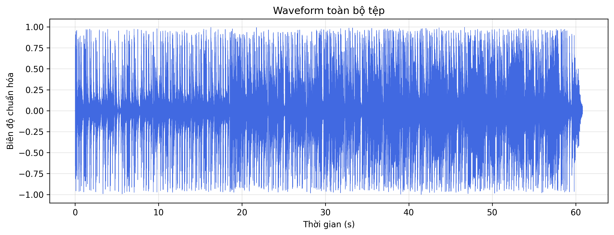
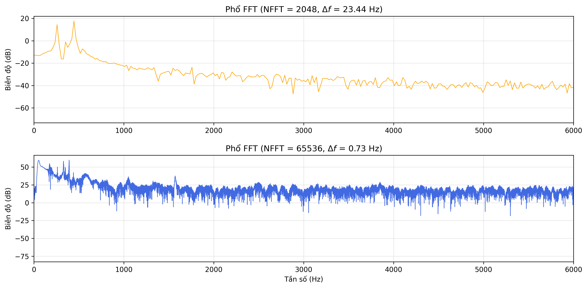
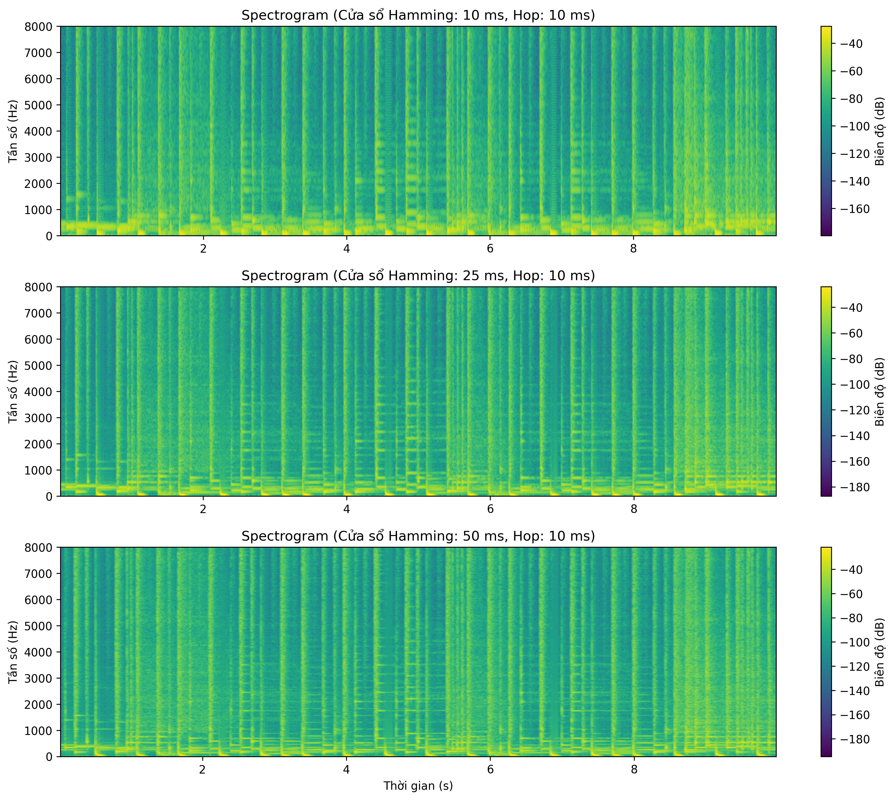
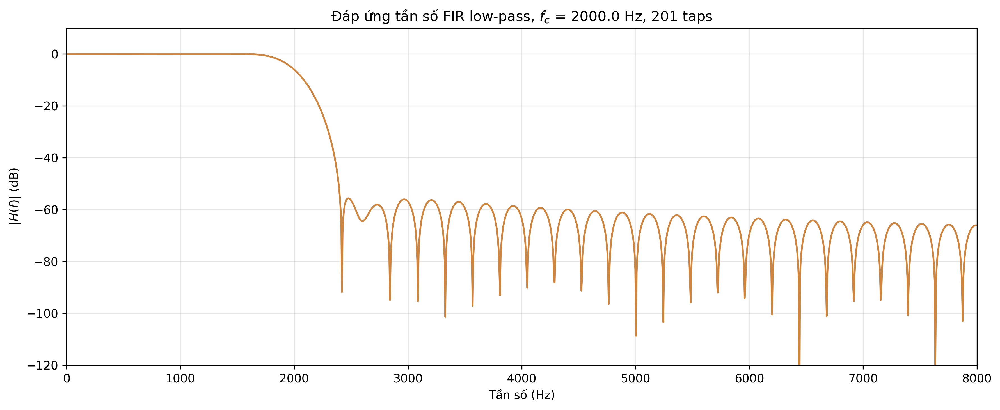

# BÁO CÁO BÀI TẬP THỰC HÀNH: LAB 1
## XỬ LÝ ÂM THANH VÀ TIẾNG NÓI (CSE457)

* **Họ và tên:** Nguyễn Quốc Bảo
* **Mã số sinh viên:** 2351260641

---

## 1. Thông tin Metadata tệp âm thanh thực nghiệm
* **Tên tệp âm thanh:** `music_input.wav` (hoặc tên tệp của bạn)
* **Tần số lấy mẫu ($F_s$):** 48,000 Hz
* **Số kênh gốc:** 2 (Stereo) $\rightarrow$ Đã chuyển đổi về Mono (1 kênh)[cite: 1]
* **Thời lượng:** 60.84 giây
* **Chỉ số miền thời gian:** 
  * Peak = 1.0[cite: 1]
  * RMS $\approx 0.2775$[cite: 1]

---

## 2. Bảng kết quả thực nghiệm Lượng tử hóa và SNR
| Số bit ($B$) | SNR đo được (dB) | Ghi chú / Trạng thái nhiễu |
| :---: | :---: | :--- |
| **4 bit** | $\approx 14.1$ dB | Nhiễu lượng tử rất lớn, âm thanh rè rõ rệt |
| **8 bit** | $\approx 39.1$ dB | Nhiễu giảm, bắt đầu rõ tiếng nhưng nền vẫn xè |
| **16 bit** | $\approx 90.9$ dB | Chất lượng cao, gần như không phân biệt được với gốc |

---

## 3. Tổng hợp hình ảnh minh họa (Thư mục `figures/`)
*   
  *Hình 1: Đồ thị dạng sóng (Waveform) toàn bộ tệp âm thanh.*[cite: 1]
*   
  *Hình 2: Phổ biên độ FFT so sánh giữa NFFT nhỏ và NFFT lớn (hiệu ứng zero-padding).*[cite: 1]
*   
  *Hình 3: Biểu đồ 2D Spectrogram khảo sát sự đánh đổi trade-off giữa độ dài khung (10 ms, 25 ms, 50 ms).*[cite: 1]
*   
  *Hình 4: Đáp ứng tần số $H(f)$ của bộ lọc FIR Low-pass ($f_c = 2$ kHz, 201 taps) và phổ trước/sau lọc.*[cite: 1]

---

## 4. Trả lời các câu hỏi lý thuyết báo cáo

### Câu 1: Giải thích bằng công thức tại sao $F_s = 44.1$ kHz chỉ biểu diễn độc lập đến $22.05$ kHz.
* **Trả lời:** Theo định lý lấy mẫu Nyquist–Shannon, tần số lấy mẫu $F_s$ phải thỏa mãn điều kiện $F_s \ge 2F_{max}$ để tín hiệu có thể được tái tạo hoàn toàn mà không bị hiện tượng chồng phổ (aliasing)[cite: 1]. Tần số cao nhất có thể biểu diễn độc lập chính là tần số Nyquist: $F_{max} = \frac{F_s}{2}$[cite: 1]. Với $F_s = 44.1$ kHz, ta có $\frac{44.1}{2} = 22.05$ kHz[cite: 1].

### Câu 2: Nếu NFFT tăng từ 2048 lên 8192 nhưng frame vẫn dài 25 ms, điều gì thật sự thay đổi và điều gì không?
* **Trả lời:** 
  * *Điều không đổi:* Độ dài thực tế của khung thời gian (số mẫu phân tích) không đổi nên **độ phân giải thực (true resolution)** dựa trên chiều dài cửa sổ vật lý không hề thay đổi[cite: 1].
  * *Điều thay đổi:* Việc tăng NFFT sử dụng kỹ thuật zero-padding làm khoảng cách giữa các bin tần số $\Delta f = \frac{F_s}{\text{NFFT}}$ thu hẹp lại, giúp biểu đồ hiển thị mịn và dày đặc điểm hơn trên trục tần số chứ không làm tăng khả năng phân tách hai đỉnh tần số gần nhau[cite: 1].

### Câu 3: Tại sao Hamming giảm spectral leakage so với rectangular nhưng có thể làm các đỉnh gần nhau khó phân tách hơn?
* **Trả lời:** Cửa sổ Hamming có búp chính (main-lobe) rộng hơn so với cửa sổ hình chữ nhật (Rectangular), do đó năng lượng bị rò rỉ sang các búp bên (side-lobes) ít hơn đáng kể (giảm spectral leakage)[cite: 1]. Tuy nhiên, vì búp chính rộng hơn, hai đỉnh tần số nằm gần nhau sẽ bị dải búp chính chồng lấp và nhập làm một, làm giảm khả năng phân tách chi tiết các thành phần tần số sát nhau.

### Câu 4: Với FIR 201 taps đối xứng tại 44.1 kHz, độ trễ xấp xỉ bao nhiêu mili giây? Có quan trọng trong xử lý thời gian thực không?
* **Trả lời:** 
  * Độ trễ nhóm (group delay) của bộ lọc FIR đối xứng bậc $M$ với số taps $N = 201$ được tính bằng: $\tau_g = \frac{N - 1}{2} = \frac{201 - 1}{2} = 100$ mẫu[cite: 1].
  * Quy đổi ra thời gian với $F_s = 44.1$ kHz: $\frac{100}{44100} \approx 2.27$ ms[cite: 1].
  * Trong các ứng dụng thời gian thực khắt khe (như tai nghe kiểm âm trực tiếp, hệ thống hội thoại VoIP), độ trễ này cần được kiểm soát chặt chẽ để tránh hiện tượng trễ tiếng hoặc lệch pha.

### Câu 5: Từ công thức $\text{SNR}_Q$, giải thích ảnh hưởng của $B$ và $\sigma_x$. Tại sao giảm mức tín hiệu đầu vào có thể làm SNR lượng tử giảm?
* **Trả lời:** Công thức SNR lượng tử đều là: $\text{SNR}_Q(\text{dB}) = 6B + 4.77 - 20\log_{10}\left(\frac{X_{max}}{\sigma_x}\right)$[cite: 1]. Trong đó $B$ là số bit và $\sigma_x$ là giá trị RMS của tín hiệu[cite: 1]. Khi giảm mức tín hiệu đầu vào mà giữ nguyên miền biên độ tối đa $X_{max}$, giá trị RMS $\sigma_x$ giảm xuống, làm tỷ lệ $\frac{X_{max}}{\sigma_x}$ tăng lên. Điều này làm tăng giá trị của số hạng trừ, dẫn đến kết quả SNR đo được giảm đi[cite: 1].

### Câu 6: Một file WAV 16-bit stereo 44.1 kHz dài 60 s có kích thước PCM lý thuyết bao nhiêu MB? So sánh với MP3 128 kbps.
* **Trả lời:**
  * Tốc độ bit PCM chuẩn: $R_{\text{PCM}} = F_s \times B \times C = 44100 \times 16 \times 2 = 1,411,200 \text{ bit/s} = 1.4112 \text{ Mbps}$[cite: 1].
  * Dung lượng lý thuyết cho 60 giây: $\text{Size} = \frac{1411200 \times 60}{8} = 10,584,000 \text{ bytes} \approx 10.09 \text{ MB}$[cite: 1].
  * So sánh với MP3 ở tốc độ 128 kbps: Tỷ lệ nén đạt khoảng $\frac{1411.2}{128} \approx 11.03 : 1$[cite: 1].

### Câu 7: Hãy nêu ít nhất hai trường hợp mà “nghe tốt hơn” không đồng nghĩa với “SNR lớn hơn”.
* **Trả lời:**
  1. *Bộ lọc tinh chỉnh chủ quan (Equalizer):* Việc tăng cường dải bass hoặc treble làm thay đổi phổ tần số và tăng sai số so với file gốc (làm giảm SNR tính toán), nhưng tai người nghe lại cảm thấy âm thanh hay, ấm và rõ ràng hơn.
  2. *Thuật toán nén có tổn hao (Lossy compression như MP3):* Codec loại bỏ các tần số mà tai người bị hiệu ứng che khuất (auditory masking); dù tín hiệu số lệch nhiều so với bản gốc (SNR thấp hơn), người nghe vẫn cảm thấy âm thanh trong trẻo, không bị chói tai.